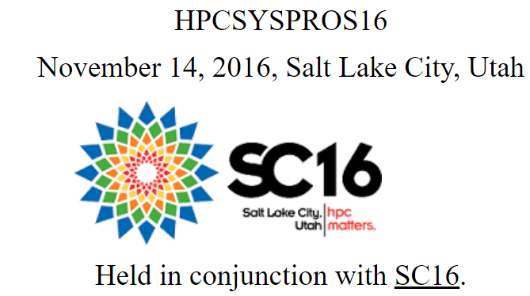

## Cluster Computing with OpenHPC

---
### Authored by Karl Schulz, Reese Baird, Yiannis Georgiou, Gregory Kurtzer, Derek Simmel, Thomas Sterling, Nirmala Sundararajan, and Eric Van Hansbergen. 
---

This paper was presented at the [HPC Systems Professionals
Workshop](http://hpcsyspros.lsu.edu/2016/) held in conjunction with
[SC16](http://sc16.supercomputing.org/) on November 14, 2016 at Salt Lake City,
Utah by members of the OpenHPC Technical Steering Committee. The pdf version of
the paper is available
[here](https://github.com/openhpc/ohpc/files/619162/HPCSYSPROS16_OpenHPC.pdf).

[{: width="700px"}](https://github.com/openhpc/ohpc/files/619162/HPCSYSPROS16_OpenHPC.pdf)
