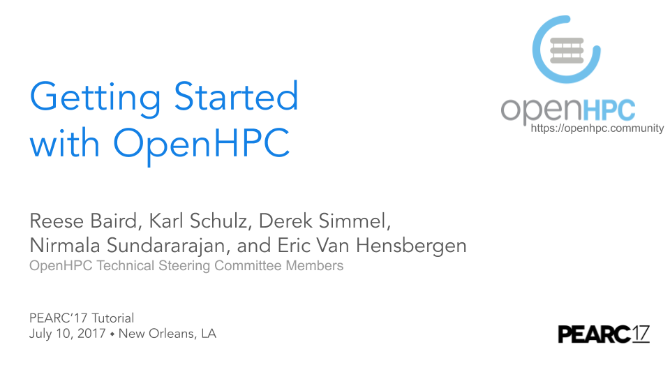

## PEARC 2017 Tutorial

---
#### Getting Started with OpenHPC
##### Tutorial Level: Beginner
##### Tutorial Length: 3.0 hours
---

This tutorial was presented at the [PEARC'17
conference](https://pearc17.sched.com/event/AQ3J/getting-started-with-openhpc?iframe=no&w=100%&sidebar=yes&bg=no)
in New Orleans, LA on July 10, 2017 by members of the OpenHPC Technical
Steering Committee. A supporting deck from this tutorial is available
[here](https://docs.google.com/presentation/d/1u56y7p-kFw9UwvEWb_gg0BBMxooUOTb85kGR8PaDf64).
The first section of these slides (thru slide #52) provides a detailed overview
of the project, packaging conventions and development environment, while the
remaining slides were used to support the hands-on installation of bare-metal
clusters by on-site participants.

[{: width="700px"}](https://docs.google.com/presentation/d/1u56y7p-kFw9UwvEWb_gg0BBMxooUOTb85kGR8PaDf64)