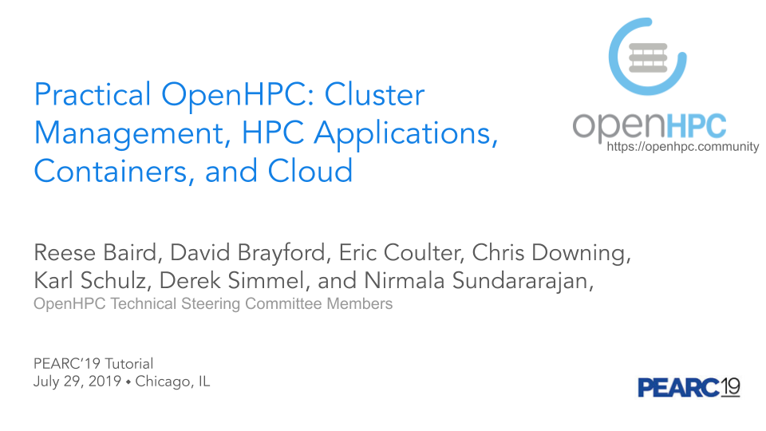

## PEARC 2019 Tutorial

---
#### Practical OpenHPC: Cluster Management, HPC Applications, Containers and Cloud
##### Tutorial Level: Intermediate
##### Tutorial Length: 3.0 hours
---

This tutorial was presented at the [PEARC'19
conference](https://pearc19.conference-program.com/presentation/?id=tut130&sess=sess112)
in Chicago, IL on July 29, 2019 by members of the OpenHPC Technical Steering
Committee. A large slide deck (~140 slides) from this tutorial is available
[here](https://docs.google.com/presentation/d/1u-GRzaeSGTNb4Qnk_rjBLb9go5xmW3mirqmchyH2Wjg/edit).
The first section of these slides (thru slide #63) provides a detailed overview of
the project, packaging conventions and development environment, while the
remaining slides were used to support hands-on system activities using
small OpenHPC-based clusters installed at the Texas Advanced Computing Center.

{:width="700px"}