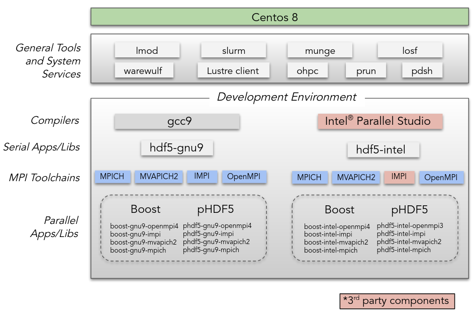
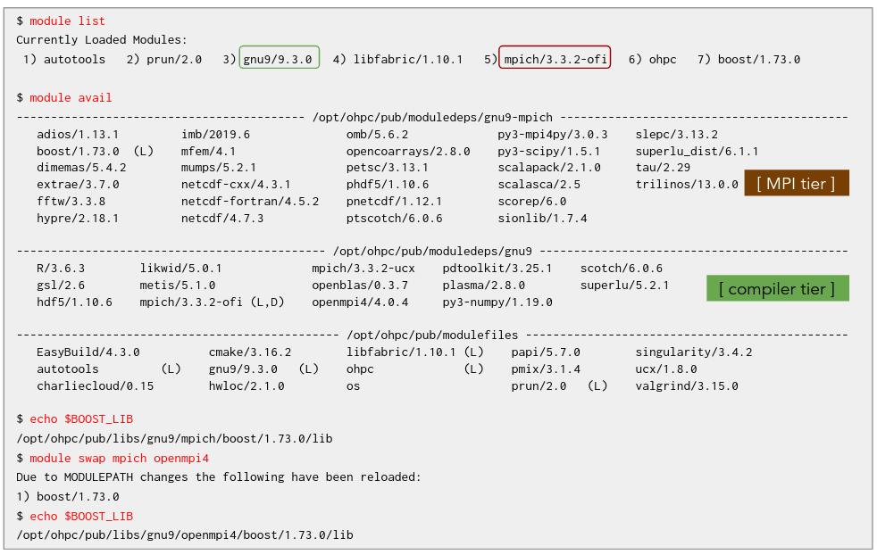

# Exercise 3: OpenHPC Software

As we discussed during the [introduction presentation](https://docs.google.com/presentation/d/1uCorXaj5Cz1qEJiCLzBSpeG0s1iFCqEmtTmDNIsmnEE),
OpenHPC is "simply" a software repository that is a series of building blocks. 
When we run OpenHPC in the cloud, we replace the provisioner (warewulf or xCAT) with packer and cloudformation. 
However, we still have the core of OpenHPC, the hierarchical software environment.

{: width="700px"}

## Working with the OpenHPC hierarchical software system (30 mins)

### The User Experience

OpenHPC provides a component hierarchy that is reflected in the user environment.

* The User interface to the OHPC software system is provided by [Lmod](https://lmod.readthedocs.io/en/latest/)
* End user sees compatible software based on the currently loaded environment
* Modulefiles for components relying on compiler/MPI variants leverage the “family” capability of Lmod
* If you switch to a different MPI variant, other related modules are updated automatically

~~~console
$ module list

Currently Loaded Modules:
  1) autotools   2) prun/2.0   3) gnu9/9.3.0   4) libfabric/1.10.1   5) mpich/3.3.2-ofi   6) ohpc

$ module add boost
~~~

{: width="700px"}

### Lmod Instantiation

Next, let's look at how Lmod gets setup upon logging into our cluster.
We will walk through an example instantiation for a BASH shell but the same generalized procedure happens for every shell.

The first thing that is sourced that is relevant is $HOME/.bashrc

~~~bash
# $HOME/.bashrc

# Source global definitions
if [ -f /etc/bashrc ]; then
        . /etc/bashrc
fi

# User specific environment
PATH="$HOME/.local/bin:$HOME/bin:$PATH"
export PATH

# Uncomment the following line if you don't like systemctl's auto-paging feature:
# export SYSTEMD_PAGER=

# User specific aliases and functions
~~~

This then sources the global definitions in /etc/bashrc.

~~~bash
# /etc/bashrc

# System wide functions and aliases
# Environment stuff goes in /etc/profile

# It's NOT a good idea to change this file unless you know what you
# are doing. It's much better to create a custom.sh shell script in
# /etc/profile.d/ to make custom changes to your environment, as this
# will prevent the need for merging in future updates.

# Prevent doublesourcing
if [ -z "$BASHRCSOURCED" ]; then
  BASHRCSOURCED="Y"

  # are we an interactive shell?

# ...
# <snipped>
# ...

    SHELL=/bin/bash
    # Only display echos from profile.d scripts if we are no login shell
    # and interactive - otherwise just process them to set envvars
    for i in /etc/profile.d/*.sh; do
        if [ -r "$i" ]; then
            if [ "$PS1" ]; then
                . "$i"
            else
                . "$i" >/dev/null
            fi
        fi
    done

# ...
~~~

Which then sources every ".sh" script in /etc/profile.d including /etc/profile.d/lmod.sh 

~~~bash
#!/bin/sh
# -*- shell-script -*-
########################################################################
#  This is the system wide source file for setting up
#  modules:
#
########################################################################

# NOOP if running under known resource manager
if [ ! -z "$SLURM_NODELIST" ];then
     return
fi

if [ ! -z "$PBS_NODEFILE" ];then
    return
fi

export LMOD_SETTARG_CMD=":"
export LMOD_FULL_SETTARG_SUPPORT=no
export LMOD_COLORIZE=no
export LMOD_PREPEND_BLOCK=normal

if [ $EUID -eq 0 ]; then
    export MODULEPATH=/opt/ohpc/admin/modulefiles:/opt/ohpc/pub/modulefiles
else
    export MODULEPATH=/opt/ohpc/pub/modulefiles
fi

export BASH_ENV=/opt/ohpc/admin/lmod/lmod/init/bash

# Initialize modules system
. /opt/ohpc/admin/lmod/lmod/init/bash >/dev/null

# Load baseline OpenHPC environment
module try-add ohpc
~~~

This lmod.sh script:
* Sets MODULEPATH to the location of the OHPC-provided modulefiles
* Initializes Lmod
* Loads the ohpc modulefile

***The ohpc modulefile is responsible for controlling the default environment***

~~~console
centos@ip-192-168-0-100 ~]$ cat /opt/ohpc/pub/modulefiles/ohpc 
#%Module1.0#####################################################################
# Default OpenHPC environment
#############################################################################

proc ModulesHelp { } {
puts stderr "Setup default login environment"
}

#
# Load Desired Modules
#

prepend-path     PATH   /opt/ohpc/pub/bin

if { [ expr [module-info mode load] || [module-info mode display] ] } {
        prepend-path MANPATH /usr/local/share/man:/usr/share/man/overrides:/usr/share/man/en:/usr/share/man
        module try-add autotools
        module try-add prun
        module try-add gnu9
        module try-add mpich
}

if [ module-info mode remove ] {
        module del mpich
        module del gnu9
        module del prun
        module del autotools
}

~~~

### Setting Default Compiler and MPI Stack for Cluster

~~~console
$ rpm -q --whatprovides /opt/ohpc/pub/modulefiles/ohpc
lmod-defaults-gnu9-mpich-ofi-ohpc-2.0-6.1.ohpc.2.0.noarch

$ rpm -ql lmod-defaults-gnu9-mpich-ofi-ohpc
/opt/ohpc
/opt/ohpc/pub
/opt/ohpc/pub/modulefiles
/opt/ohpc/pub/modulefiles/ohpc

~~~

***Multiple versions of the ohpc modulefile are available through mutually exclusive lmod-default packages.***

~~~console
[centos@ip-192-168-0-100 ~]$ dnf search lmod-defaults ohpc
CentOS-8 - AppStream                                                                                           26 MB/s | 5.8 MB     00:00
CentOS-8 - Base                                                                                               2.1 MB/s | 2.2 MB     00:01
CentOS-8 - Extras                                                                                              61 kB/s | 8.1 kB     00:00
CentOS-8 - PowerTools                                                                                         5.5 MB/s | 1.9 MB     00:00
OpenHPC-2 - Base                                                                                               21 MB/s | 3.1 MB     00:00
OpenHPC-2 - Updates                                                                                           5.5 kB/s | 257  B     00:00
Extra Packages for Enterprise Linux Modular 8 - x86_64                                                        217 kB/s |  97 kB     00:00
Extra Packages for Enterprise Linux 8 - x86_64                                                                5.7 MB/s | 8.3 MB     00:01
===================================================== Name Matched: ohpc, lmod-defaults ======================================================
lmod-defaults-gnu9-impi-ohpc.noarch : OpenHPC default login environments
lmod-defaults-gnu9-impi-ohpc.src : OpenHPC default login environments
lmod-defaults-arm1-mpich-ohpc.noarch : OpenHPC default login environments
lmod-defaults-intel-impi-ohpc.noarch : OpenHPC default login environments
lmod-defaults-arm1-mpich-ohpc.src : OpenHPC default login environments
lmod-defaults-intel-impi-ohpc.src : OpenHPC default login environments
lmod-defaults-intel-mpich-ohpc.noarch : OpenHPC default login environments
lmod-defaults-intel-mpich-ohpc.src : OpenHPC default login environments
lmod-defaults-arm1-openmpi4-ohpc.noarch : OpenHPC default login environments
lmod-defaults-gnu9-mvapich2-ohpc.noarch : OpenHPC default login environments
lmod-defaults-gnu9-openmpi4-ohpc.noarch : OpenHPC default login environments
lmod-defaults-arm1-openmpi4-ohpc.src : OpenHPC default login environments
lmod-defaults-gnu9-mvapich2-ohpc.src : OpenHPC default login environments
lmod-defaults-gnu9-openmpi4-ohpc.src : OpenHPC default login environments
lmod-defaults-gnu9-mpich-ofi-ohpc.noarch : OpenHPC default login environments
lmod-defaults-gnu9-mpich-ucx-ohpc.noarch : OpenHPC default login environments
lmod-defaults-intel-mvapich2-ohpc.noarch : OpenHPC default login environments
lmod-defaults-intel-openmpi4-ohpc.noarch : OpenHPC default login environments
lmod-defaults-gnu9-mpich-ofi-ohpc.src : OpenHPC default login environments
lmod-defaults-gnu9-mpich-ucx-ohpc.src : OpenHPC default login environments
lmod-defaults-intel-mvapich2-ohpc.src : OpenHPC default login environments
lmod-defaults-intel-openmpi4-ohpc.src : OpenHPC default login environments
[centos@ip-192-168-0-100 ~]$ 
~~~

~~~console
$ sudo dnf -y remove lmod-defaults-gnu9-mpich-ofi-ohpc
$ sudo dnf -y install lmod-defaults-gnu9-openmpi4-ohpc
$ logout
~~~

Now log back in and you'll see that the default module stack has changed.

~~~console
$ ml list

Currently Loaded Modules:
  1) autotools   2) prun/2.0   3) gnu9/9.3.0   4) ucx/1.8.0   5) libfabric/1.10.1   6) openmpi4/4.0.4   7) ohpc   8) boost/1.73.0
~~~

Finally, let's return out module stack defaults back to mpich.

~~~console
$ sudo dnf -y remove lmod-defaults-gnu9-openmpi4-ohpc && sudo dnf -y install lmod-defaults-gnu9-mpich-ofi-ohpc 
$ logout
~~~

Using the lmod-defaults packages, you can control which compiler / MPI stack combo is the system default.
If you'd like to further customize the default module environment for all users, simply create site-specific /etc/profile.d SHELL profiles.

If you'd like to customize modules on a per user basis, that is done using LMOD collections.

### Customizing Default Modules Loaded (The Default Collection)

Modules can be grouped into collections and used to create a declarative way to restore environments.
Collections can also be used to define the default environment on a per user basis.

~~~console
[centos@ip-192-168-0-100 ~]$ ml list

Currently Loaded Modules:
  1) autotools   2) prun/2.0   3) gnu9/9.3.0   4) libfabric/1.10.1   5) mpich/3.3.2-ofi   6) ohpc

$ ml load openblas gsl petsc boost fftw phdf5
$ ml save
Saved current collection of modules to: "default"

$ echo "module restore" >> ~/.bashrc 
$ logout
Connection to ec2-x-xxx-xx-xxx.compute-1.amazonaws.com closed.
$ ssh -i cluster-sc20.pem centos@ec2-x-xxx-xx-xxx.compute-1.amazonaws.com
load pubkey "cluster-sc20.pem": invalid format
Activate the web console with: systemctl enable --now cockpit.socket

Last login: Sun Nov  8 21:47:23 2020 from 97.99.192.170
Restoring modules from user's default
$ ml list

Currently Loaded Modules:
  1) autotools   3) gnu9/9.3.0         5) mpich/3.3.2-ofi   7) openblas/0.3.7   9) scalapack/2.1.0  11) boost/1.73.0  13) phdf5/1.10.6
  2) prun/2.0    4) libfabric/1.10.1   6) ohpc              8) gsl/2.6         10) petsc/3.13.1     12) fftw/3.3.8
~~~

Additional modules can be loaded and added to the default environment at any time.

~~~console
$ ml load charliecloud valgrind
$ ml save
Saved current collection of modules to: "default"

$ ml list

Currently Loaded Modules:
  1) autotools    4) libfabric/1.10.1   7) openblas/0.3.7   10) petsc/3.13.1  13) phdf5/1.10.6
  2) prun/2.0     5) mpich/3.3.2-ofi    8) gsl/2.6          11) boost/1.73.0  14) charliecloud/0.15
  3) gnu9/9.3.0   6) ohpc               9) scalapack/2.1.0  12) fftw/3.3.8    15) valgrind/3.15.0
~~~

### Working with Module Collections

Using the `module save` command, we can set up multiple, named collections.
Collections allow us to declarively switch between multiple development environment.

~~~console
$ ml save mpich-stack
Saved current collection of modules to: "mpich-stack"

$ ml swap mpich openmpi4

Due to MODULEPATH changes, the following have been reloaded:
  1) boost/1.73.0     2) fftw/3.3.8     3) petsc/3.13.1     4) phdf5/1.10.6     5) scalapack/2.1.0

$ ml save openmpi4-stack
Saved current collection of modules to: "openmpi4-stack"

$ ml restore mpich-stack
~~~

Now that our collections are set up, let's see how to use them.

~~~console
$ which mpicc
/opt/ohpc/pub/mpi/mpich-ofi-gnu9-ohpc/3.3.2/bin/mpicc
$ echo $PETSC_LIB/
/opt/ohpc/pub/libs/gnu9/mpich/petsc/3.13.1/lib/
$ ml restore openmpi4-stack 
Restoring modules from user's openmpi4-stack
$ which mpicc
/opt/ohpc/pub/mpi/openmpi4-gnu9/4.0.4/bin/mpicc
$ echo $PETSC_LIB/
/opt/ohpc/pub/libs/gnu9/openmpi4/petsc/3.13.1/lib/
$ ml restore mpich-stack
Restoring modules from user's mpich-stack

~~~

